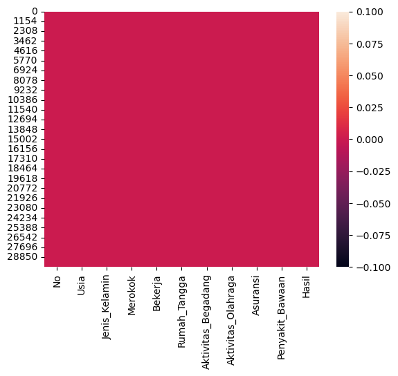
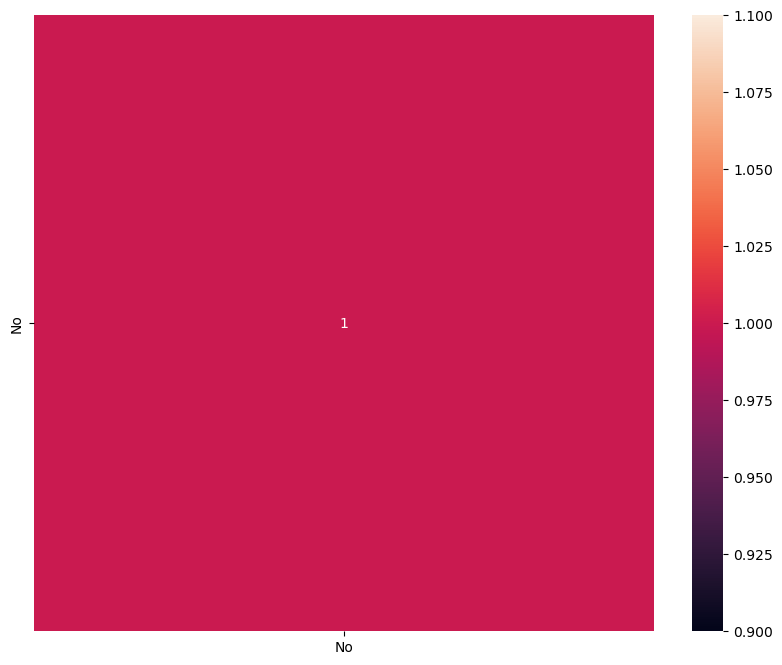

# Laporan Proyek Machine Learning
### Nama    : Melinda Purnama Dewi
### Nim     : 211351082
### Kelas   : Pagi B

## Domain Proyek
Dataset Predic Terkena Penyakit Paru-Paru 
Projek ini dapat digunakan memprediksi kemungkinan seseorang terkena penyakit paru-paru terutama pada individu yang memiliki riwayat merokok atau paparan asap rokok dan dapat membantu dalam pencegahan deteksi sejak dini.

## Business Understanding
Dapat menentukan apakah seseorang beresiko terkena penyakit paru-paru, berdasarkan faktor-faktor tertentu dan dapat mencegah penyakit menjadi kronis.

### Problem Statements
Ketidakmungkinan bagi seseorang menyadari aktivitas merokok secara berlebihan yang merupakan salah satu penyebab penyakit paru- paru.

### Goals
Mendiagnosa sejak awal terhadap gejala yang diderita penyakit paru - paru yang disebabkan perokok aktif dan juga orang- orang yang disekitar yang terpapar asap rokok.

## Data Understanding

[Dataset predic terkena penyakit paru paru](https://www.kaggle.com/datasets/andot03bsrc/dataset-predic-terkena-penyakit-paruparu)

### Variabel-variabel pada Heart Failure Prediction Dataset adalah sebagai berikut:
- Usia                : Merupakan umur pasien[muda,tua] Tipe data:String 
- Jenis kelamin       : Merupakan jenis kelamin pasien meliputi[pria,wanita] Tipe data:String 
- Merokok             : Merupakan tindakan menghisap dan menghirup asap yang dihasilkan oleh pembakaran tembakau [aktif,pasif] Tipe data:String
- Bekerja             : Merupakan aktivitas yang melibatkan usaha fisik atau mental yang dilakukan oleh individu atau kelompok dalam rangka mencari nafkah [ya,tidak] Tipe data:String
- Aktivitas_Begadang  : Seseorang yang melakukan kegiatan pada saat malam hari diwaktu tidur [ya,tidak] Tipe data:String
- Aktivitas_Olahraga  : Kegiatan menggerakan anggota badan yang dilakukan untuk meningkatan kebugaran fisik [jarang,seing] Tipe data:String 
- Penyakit Bawaan     : Penyakit atau gangguan kesehatan yang dimiliki sesorang sejak lahir[ada,tidak] Tipe data:String

## Data Preparation
## Data Collection
Untuk data colletion ini, saya mendapatkan dataset yang nanti dapat digunakan dari website kaggle dengan nama Dataset Predic Terkena Penyakit Paru-Paru jika anda tertarik dengan dataset tesebut bisa klik diatas.

## Data Discovery and Profiling 
Untuk bagian ini saya menggunakan Teknik EDA

- Tentukan library yang digunakan, disini saya menggunakan vscode.
```bash
import numpy as np
import pandas as pd
import matplotlib.pyplot as plt
import seaborn as sns
```
- Selanjutnya masukan datasetnya.

```bash
df = pd.read_csv('C:/Users/user/Documents/SEMESTER 5/MESIN 1 PAK TEGUH/Free uts/predic_tabel.csv')
```
- Untuk type data dari masing masing kolom kita bisa menggunakan property info

```bash
df.info()
```
- Selanjutnya kita akan memeriksa apakah datasetsnya tersebut terdapat baris yang kosong atau null dengan menggunakan seaborn

```bash
sns.heatmap(df.isnull())
```
 <br>
-  Lanjutkan data exploration kita
```bash
plt.figure(figsize=(10,8))
sns.heatmap(df.corr(), annot=True)
```
 <br>

## Modeling
- Model yang saya gunakan adalah Logistik Regresi
Logistik Regresi adalah Metode statistik yang digunakan untuk menganalisis hubungan antara satu atau lebih variabel independen (biasanya variabel kategorikal) dengan variabel dependen biner (biasanya variabel yang memiliki dua kategori, seperti "ya" atau "tidak", "sukses" atau "gagal", "positif" atau "negatif"). 

- Tujuan dari logistik regresi adalah untuk memodelkan probabilitas bahwa suatu kejadian akan terjadi berdasarkan variabel independen yang diberikan.

- Rumus: P(Y=1)= 1 / 1+e −(a+bX)

- Membagi dataset menjadi x dan y, standarisasi yang dilakukan standart scaler dan standarisasi yang dilakukan kepada x,membagi data menjadi train dan test sama rata,model yang digunakan logistik regresi,menghitung keberhasilan model melalui akurasi train dan test.

- Sebelumnya mari kita import library yang nanti akan digunakan
```bash
from sklearn.model_selection import train_test_split
from sklearn.linear_model import LogisticRegression
```
- Langkah pertama adalah kita memasukkan kolom-kolom fitur yang ada di datasets dan juga kolom targetnya
```bash
X = df.drop (columns='Hasil', axis=1)
Y = df['Hasil']
```

- Pembagian X dan Y menjadi train dan test masing masing 
```bash
X_train, X_test, Y_train, Y_test = train_test_split(X, Y, stratify=Y, random_state=2)
```

- Mari kita lanjut dengan membuat model Logistik Regressionnya
```bash
model = LogisticRegression()
```

- Mari lanjut, memasukkan x_train dan y_train pada model dan memasukkan value predict pada X_train_pred,
```bash
model.fit(X_train, Y_train)
X_train_pred = model.predict(X_train)
```

- Sekarang kita bisa melihat akurasi dari model kita 
```bash
training_data_accuracy = accuracy_score(X_train_pred, Y_train)
print('akurasi : ', training_data_accuracy)
```

- Akurasi model nya yaitu 94 %, selanjutnya mari kita test menggunakan sebuah array value.
```bash
input_data = (1,	1,	1,	0,	1,	1,	0, 1, 1)
input_data_np = np.array(input_data)
input_data_reshape = input_data_np.reshape(1,-1)

std_data = scaler.transform(input_data_reshape)

prediksi = model.predict(std_data)
print(prediksi)

if(prediksi[0] == 1 ):
  print("Positif")
else:
  print('Negatif')

  - Sekarang modelnya sudah selesai, mari kita export sebagai file sav agar nanti bisa kita gunakan pada project web streamlit kita.

  import pickle

filename = 'predic_tabel1.sav'
pickle.dump(model, open(filename,'wb'))
```

## Evaluation

- Penjelasan mengenai metrik yang digunakan
Presisi (Precision) adalah salah satu metrik evaluasi yang digunakan dalam konteks model klasifikasi,ini mengukur sejauh mana prediksi positif yang dibuat oleh model adalah benar atau akurat.

Rumus Presisi = TP /TP+FP

- Menjelaskan hasil proyek berdasarkan metrik evaluasi
```bash
#Library evaluasi
from sklearn.metrics import confusion_matrix
from sklearn.metrics import classification_report

#Compute performance manually
NewprediksiBenar = (predicted == Y_test).sum()
NewprediksiSalah = (predicted != Y_test).sum()

print("prediksi benar: ", NewprediksiBenar, " data")
print("prediksi salah: ", NewprediksiSalah, " data")
print("Akurasi Algoritme: ", NewprediksiBenar/(NewprediksiBenar+NewprediksiSalah)*100,"%")

CM = confusion_matrix(Y_test,predicted)

TN = CM[0][0]
FN = CM[1][0]
TP = CM[1][1]
FP = CM[0][1]
precision    = TP/(TP+FP)

Akurasi Algoritme:  94.3 %
precision = 100. %
RECALL: 88.1%
f1score:  93.7%
```

## Deployment
pada bagian ini anda memberikan link project yang diupload melalui streamlit share. boleh ditambahkan screen shoot halaman webnya.
https://prediksiparu-g38c8cxxgfhecd4xnurssq.streamlit.app/

https://github.com/melindapurnamadewi9/prediksi_paru/tree/main

_Catatan:_
- _Anda dapat menambahkan gambar, kode, atau tabel ke dalam laporan jika diperlukan. Temukan caranya pada contoh dokumen markdown di situs editor [Dillinger](https://dillinger.io/), [Github Guides: Mastering markdown](https://guides.github.com/features/mastering-markdown/), atau sumber lain di internet. Semangat!_
- Jika terdapat penjelasan yang harus menyertakan code snippet, tuliskan dengan sewajarnya. Tidak perlu menuliskan keseluruhan kode project, cukup bagian yang ingin dijelaskan saja.
